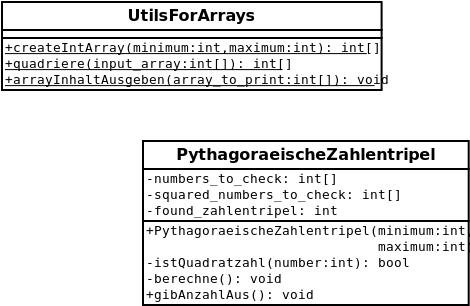

# Topic: Arrays, Kontrollstrukturen

## how to build project

- `make`
  - build jar file

## how to run/test project

- `make test`
  - just test
- `make testbuild`
  - test built jar file
- `java -jar PythagoraeischeZahltripelMain.jar`
  - run application after build step

